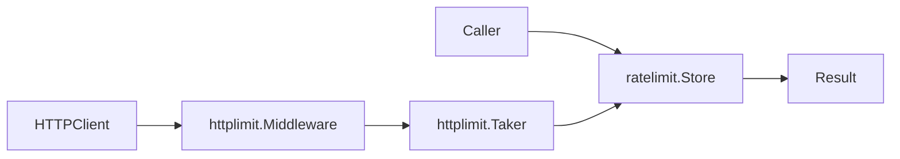
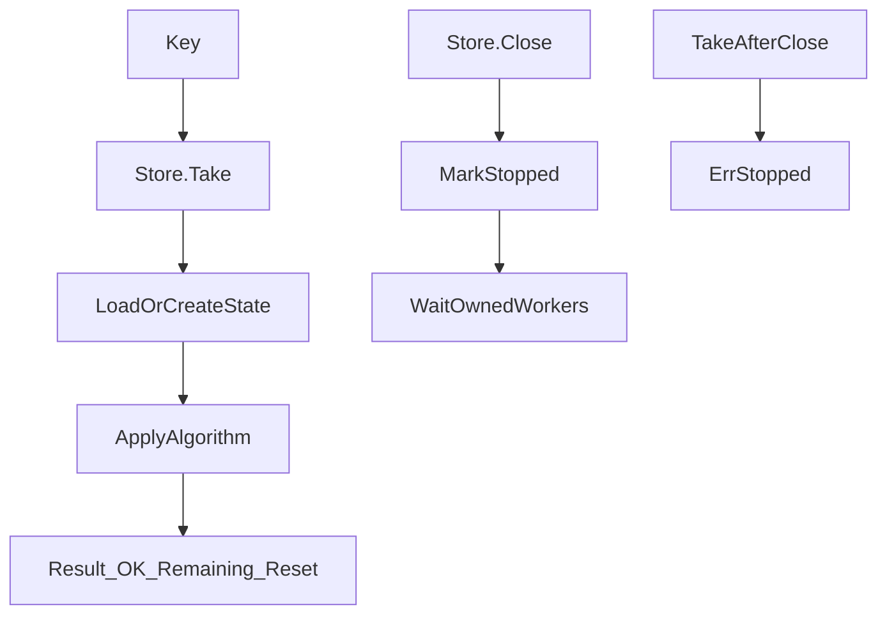
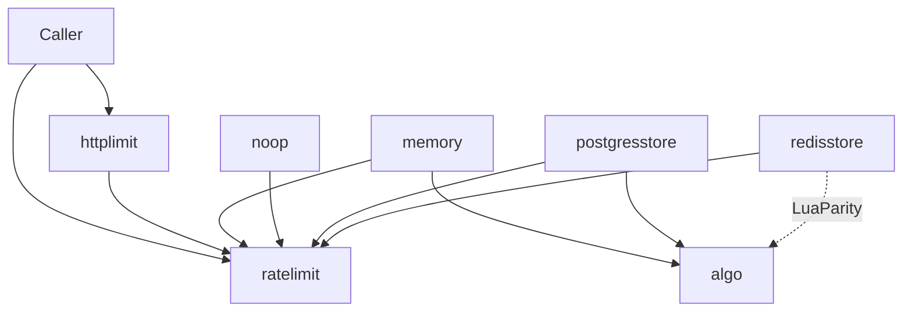

# ratelimit-gopher architecture

This document gives the high-level system architecture of the
ratelimit-gopher library.

## Purpose and scope

ratelimit-gopher provides **store-based rate limiting** for application
code and HTTP servers.
Callers configure a store with a token capacity and an interval, then call
`Take` with a string key.
The result says whether the request is allowed, how many tokens remain, and
when capacity replenishes.

This file covers:

- The multi-module shape and package map
- The Take / Close data flow
- Shared algorithm math versus Redis Lua
- Backend roles (memory, noop, Redis, Postgres)
- HTTP middleware contracts
- Public API and error contracts at a high level

This file does **not** cover:

- Full usage examples — see [README.md](../../README.md) and
  [`examples/`](../../examples/)
- Store edit checklists — see
  [ratelimit-store](../skills/ratelimit-store/SKILL.md) and
  [new-store-checklist](../commands/new-store-checklist.md)
- Agent index — see [AGENTS.md](../../AGENTS.md)

## System context

The caller talks to a `ratelimit.Store`.
Optional `httplimit` middleware turns HTTP requests into `Take` calls and
writes rate-limit headers.

The **core** module uses the Go standard library only.
Redis and PostgreSQL backends live in separate modules so core stays
dependency-free.



## Request flow

1. Resolve a string **key** (caller-chosen, or via `httplimit` key funcs).
2. Call `Take(ctx, key)`.
3. The store loads or creates per-key state, applies the configured
   `Algorithm`, and returns a `Result`.
4. On shutdown, call `Close(ctx)`. Later `Take` calls return
   `ratelimit.ErrStopped`.

Keys are stored as provided.
Scrub or HMAC sensitive identifiers before `Take` when the store is shared
or durable.

Redis and `*sql.DB` handles are owned by the caller.
Store `Close` does not close them.



See [`store.go`](../../store.go) for the `Store` / `Result` / `ErrStopped`
contracts.

## Module map

Three Go modules (`go.work`):

| Module path | Packages | Role |
| ----------- | -------- | ---- |
| `github.com/deangrant/ratelimit-gopher` | `ratelimit`, `algo`, `memory`, `noop`, `httplimit` | Core API and in-process stores |
| `github.com/deangrant/ratelimit-gopher/redisstore` | `redisstore` | Redis + Lua |
| `github.com/deangrant/ratelimit-gopher/postgresstore` | `postgresstore` | PostgreSQL + `algo` |

The module path contains a hyphen.
The root **package name** is `ratelimit`.

| Package | Role |
| ------- | ---- |
| `ratelimit` | `Store`, `Result`, `Algorithm`, `MaxTokens`, `ErrStopped` |
| `algo` | Pure-Go algorithm math shared by memory and postgres |
| `memory` | Sharded in-memory store and idle sweeper |
| `noop` | Always-allow store until Close |
| `httplimit` | `net/http` middleware (`Taker` only) |
| `redisstore` | Redis store; Lua mirrors `algo` |
| `postgresstore` | SQL store; row lock then `algo.Take` |



Root `go test ./...` / `go build ./...` covers the core module only.
Use `-C redisstore` and `-C postgresstore` (or the verify command) for the
optional modules.

## Shared algorithm layer

[`algo`](../../algo/algo.go) is the pure-Go reference implementation.
`Fresh` builds initial per-key `State`.
`Take` mutates state and returns a `ratelimit.Result`.

`memory` and `postgresstore` call `algo` directly.
`redisstore` reimplements the same math in Lua
([`redisstore/scripts.go`](../../redisstore/scripts.go)) so Redis can
evaluate limits atomically on the server clock (`TIME`).

Change both sides when altering algorithm behavior.
Run [`TestAlgoRedisParity`](../../redisstore/parity_test.go) after edits.
See rule [algo-lua-parity](../rules/algo-lua-parity.mdc).

Algorithms (`ratelimit.Algorithm`):

| Constant | Role |
| -------- | ---- |
| `TokenBucket` | Continuous refill; bursts up to `Tokens` (default / zero value) |
| `LeakyBucket` | Constant drain meter; reject when full (not a queue) |
| `FixedWindow` | Counts in fixed `Interval` windows |
| `SlidingWindowLog` | Timestamp log for precise windows |
| `SlidingWindowCounter` | O(1) sliding approximation |

## Backends

### memory

[`memory`](../../memory/store.go) shards keys (FNV) across 64 mutex maps.
Each Take uses `algo` with an injectable clock in tests.
A background sweeper evicts idle keys after `SweepMinTTL` (default
`3 * Interval`).

### noop

[`noop`](../../noop/noop.go) always allows until `Close`.
`Limit` / `Remaining` use `math.MaxUint64` to signal unlimited capacity.

### redisstore

[`redisstore`](../../redisstore/store.go) requires `Interval >= 1ms`.
Scripts and `PEXPIRE` use millisecond resolution.
The caller passes `redis.Cmdable` and owns its lifecycle.
Key prefix defaults to `ratelimit:`.

### postgresstore

[`postgresstore`](../../postgresstore/store.go) takes `*sql.DB` and
`New(ctx, cfg)`.
Unless `SkipMigrate` is set, `New` runs `EnsureSchema`.
Take uses a transaction with row lock, then `algo.Take`, then update.
An idle sweeper deletes stale rows by `updated_at`.

## HTTP middleware

[`httplimit`](../../httplimit/middleware.go) depends on `Taker`
(`Take` only), not full `Store` (ISP).

On each request:

1. Derive a key (`IPKeyFunc` or `TrustedForwardedIPKeyFunc`).
2. Call `Take`.
3. Set `X-RateLimit-Limit`, `X-RateLimit-Remaining`, `X-RateLimit-Reset`.
4. If not `OK`, respond `429` with `Retry-After`.

Default fail-closed: Take errors → `500`; `ErrStopped` → `503`.
`WithFailOpen` allows the request when Take fails.

## Public surface

Stable core surface:

- `ratelimit.Store`, `Result`, `Algorithm`, `MaxTokens`, `ErrStopped`
- `memory.New`, `noop.New`
- `httplimit.NewMiddleware`, key funcs, `WithFailOpen`

Optional modules:

- `redisstore.New`
- `postgresstore.New`

Runnable demos live under [`examples/`](../../examples/).

Extension point for new backends: implement `ratelimit.Store`, validate
`Tokens` / `Interval` / `Algorithm`, preserve Close / `ErrStopped`
semantics, and prefer `algo` when in-process.
See [new-store-checklist](../commands/new-store-checklist.md).

## Errors and contracts

| Situation | Behavior |
| --------- | -------- |
| Missing key | Create lazily; not an error |
| Backend / network failure | Returned as `error`; fail-open vs closed is caller policy |
| After `Close` | `Take` returns `ErrStopped` |
| `Close` | Idempotent; marks stopped **before** waiting on owned workers |
| Aborted Close wait | Store stays stopped; may return `ctx.Err()` |
| `Tokens` | Must be in `1..MaxTokens` (`(1<<53)-1`) |
| Redis `Interval` | Must be `>= 1ms` |
| Memory / Postgres `Interval` | Must be `> 0` |

A brief allow-after-stop race is possible for in-flight takes that observed
the store as open.
Drain callers outside the store if you need a hard cut.

## Verification and agent layout

Local verify (CI parity) is documented in
[verify-all](../commands/verify-all.md):

```bash
go build ./...
go build -C redisstore ./...
go build -C postgresstore ./...
go test ./... -race -count=1
go test -C redisstore ./... -race -count=1
go test -C postgresstore ./... -race -count=1
# golangci-lint fmt --diff and run in ., redisstore, postgresstore
```

After algo or Lua changes, run
[parity-redis](../commands/parity-redis.md).

Agent support lives under `.agents/`:

- `docs/` — this architecture file
- `rules/` — project and package policies
- `skills/` — store domain, Google Go style, SOLID Go
- `commands/` — verify and checklists
- `hooks/` — gofmt and algo/Lua parity reminder

See [AGENTS.md](../../AGENTS.md) for the full index.
